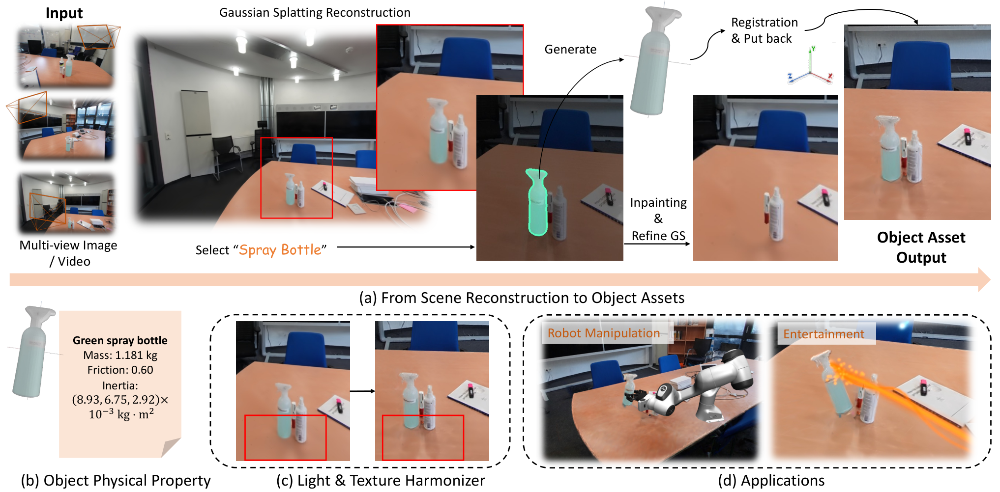
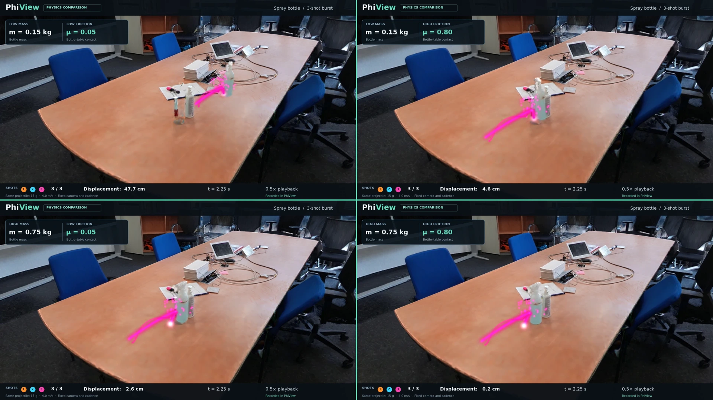
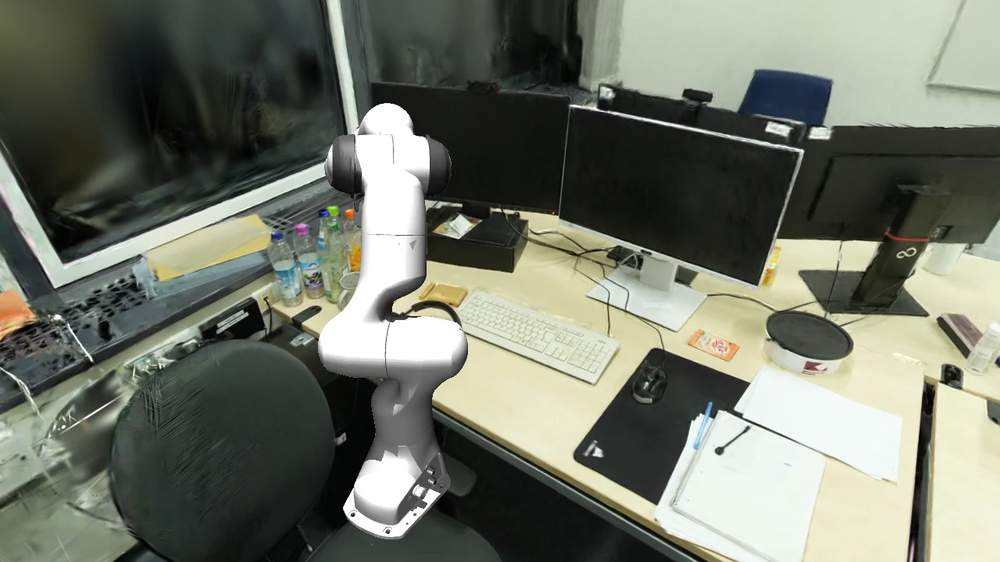
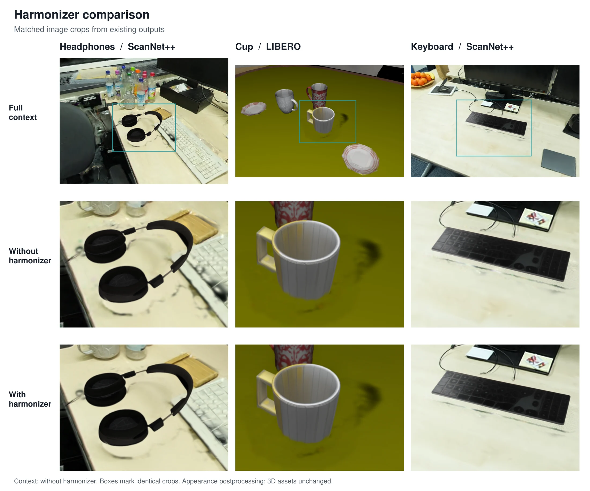
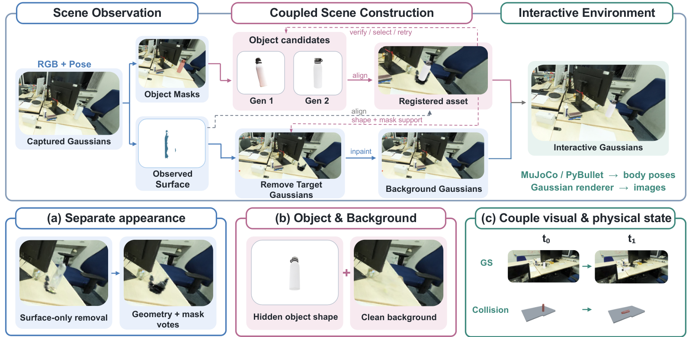
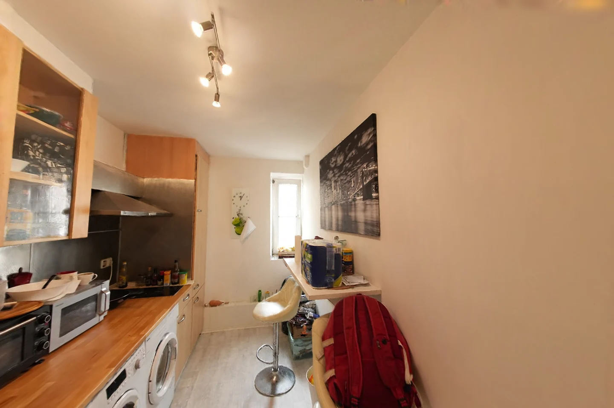
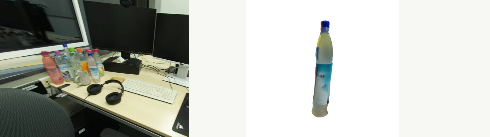
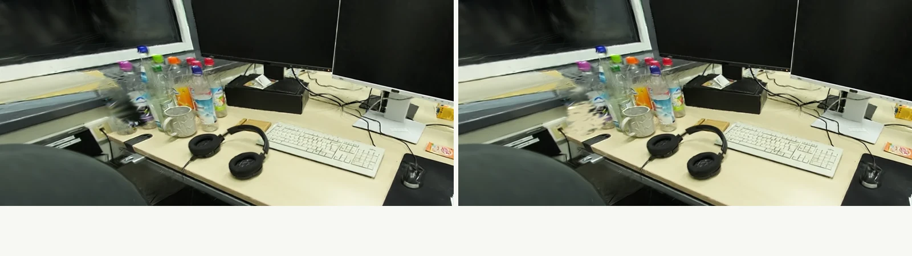

# ϕ-RIE

### From Photorealistic Reconstruction to Interactive Environments

[Project page](https://insait-institute.github.io/PhiRIE/) · [Paper](https://arxiv.org/abs/2609.26795) · [Citation](#citation) · [Demo video](https://youtu.be/3-YdcBh6Tbw) · [PhiView code](https://github.com/RunyiYang/PhysicalView)

**ϕ-RIE turns captured rooms into editable environments.** It connects object
discovery, 3D asset generation, metric registration, background completion, and
physics. PhiView lets you explore the result, change object parameters, shoot
projectiles, and run robot interactions.



[Runyi Yang](https://runyiyang.github.io/), [Deheng Zhang](https://dehezhang2.github.io/), [Xiaoye Wang](https://adamwang0224.github.io/), [Kanzhi Wu](https://www.kanzhi.tech/about), [Lei Sun](https://ahupujr.github.io/), [Ajad Chhatkuli](https://ajadchhatkuli.github.io/), [Kunyu Peng](https://kpeng9510.github.io/)*, [Luc Van Gool](https://insait.ai/prof-luc-van-gool/), [Danda Paudel](https://insait.ai/dr-danda-paudel/)

INSAIT, Sofia University “St. Kliment Ohridski” · vivo Mobile Communication Co., Ltd. · Karlsruhe Institute of Technology

Contact: [runyi.yang@insait.ai](mailto:runyi.yang@insait.ai)

*Corresponding author

## Image demos

| Shooting and physical parameters | Grasp and place |
|---|---|
|  |  |
| Three colorful shots per setting | Lift the bottle and move it to the target |



Watch [the full demo](https://youtu.be/3-YdcBh6Tbw) or explore
[all nine recordings](https://insait-institute.github.io/PhiRIE/#motion) on the project page.

## Method overview



The pipeline connects captured Gaussian scenes to complete object assets and
backgrounds, then keeps rendered appearance aligned with simulated body poses.

## 1. Installation

### Start with the control tools

Install [uv](https://docs.astral.sh/uv/getting-started/installation/), then:

```bash
git clone https://github.com/insait-institute/PhiRIE.git
cd PhiRIE
uv sync --project envs/control --locked
bash run/phiroom.sh modules
```

The control environment lists components, prepares commands, and runs CPU tools.
The checkout includes the PhiView source in `tools/phiview/`.

### Set up reconstruction and simulation

GPU reconstruction and rendering require an NVIDIA GPU and the runtime for the
selected model. Prepare the environments, data, and weights with these guides:

| Setup | Guide |
|---|---|
| Python, CUDA, and model environments | [Environment setup](docs/ENVIRONMENTS.md) |
| Captured views, camera poses, reconstructions, and weights | [Data and weights](docs/DATA_AND_WEIGHTS.md) |
| PhiView rendering and interaction | [PhiView setup](docs/PHIVIEW.md) |
| Independent component commands | [Module interfaces](docs/MODULES.md) |

## 2. Prepare data, weights and environments

Datasets live under `data/`, run products under `outputs/`, vendored checkouts
under `third_party/`, and downloaded weights under `weights/` and `checkpoints/`;
all of them are gitignored. Every location is resolved by `run/env.sh` and
`agents/core/common.py` and can be overridden with an environment variable.

### Python environments

The GPU stages need separate interpreters because their torch builds are
mutually incompatible. `run/env.sh` resolves them and exposes one helper per
environment (`run <package>.<module> [args]`):

| Helper | Variable | Default | Runs |
|---|---|---|---|
| `run` | `SIMANY_PY` | `.venv/bin/python` | everything not listed below (torch 2.4.1+cu124) |
| `run_sam3` | `SIMANY_SAM3_PY` | `.envs/sam3/bin/python` | SAM3 discovery and masks, Qwen-Image-Edit (torch >= 2.5) |
| `run_gs` | `SIMANY_GSPLAT_PY` | `.envs/mini-viewer/bin/python` | gsplat CUDA renders and 3DGS training (Python 3.10 wheel) |
| `run_qwen` | `QWEN_PY` | same as `SIMANY_PY` | `agents.edit.inpaint_qwen`; set `QWEN_PY=$SIMANY_SAM3_PY` for the Qwen backend |
| `run_sam3d` | `SIMANY_SAM3D_PY` | `.envs/sam3d-objects/bin/python` | optional SAM 3D Objects generator |

1. Create `.venv/` (Python 3.11) and run `bash run/setup_env.sh`. It installs
   torch 2.4.1+cu124, open3d, trimesh, coacd, pybullet, transformers, xformers,
   spconv, gsplat, Depth Anything 3 and simple-lama-inpainting, clones
   `third_party/TRELLIS`, and ends with an import smoke test.
2. Create the sam3 environment (torch >= 2.5, diffusers >= 0.39, the `sam3`
   package) and the gsplat environment (Python 3.10, prebuilt gsplat CUDA
   wheel); point `SIMANY_SAM3_PY` and `SIMANY_GSPLAT_PY` at them.
3. The CPU control environment for `run/phiroom.sh` is locked:
   `uv sync --project envs/control --locked`. The `phiroom` CLI reads the same
   variables, or explicit paths from `configs/runtime.local.json` (copy
   `configs/runtime.example.json`).

`run/env.sh` sets `HF_HUB_OFFLINE=1` and `TORCH_CUDA_ARCH_LIST="8.6;9.0+PTX"`
unless they are exported first, and honours `HF_HOME` and `TORCH_HOME`.
[Environment setup](docs/ENVIRONMENTS.md) explains why the environments cannot
be merged and lists the optional ones.

### Datasets

| Dataset | Variable | Default | Layout |
|---|---|---|---|
| ScanNet++ v2 | `SIMANY_SCANNETPP_ROOT` | `/data/ScanNetpp` | `data/<scene_id>/dslr/resized_undistorted_images/`, `dslr/colmap/images.txt`, `dslr/nerfstudio/transforms_undistorted.json`, `scans/mesh_aligned_0.05.ply`; `scans/segments*.json` only for the GT-driven mode |
| Prebuilt 3DGS splats | `SIMANY_SPLATS_ROOT` | `/data/ScanNetppv2_gsplat/splats` | one Inria-format `<scene_id>.ply` per scene, in the scan-mesh frame |

`data/` is an empty mount point. Select a scene with `SIMANY_SCENE`; outputs go
to `SIMANY_OUT` (default `outputs/<scene>` plus a mode suffix). Scenes
reconstructed from a phone video by `run/run_video2sim.sh` are written in the
same layout under `data/recon_scenes/`, so no dataset is needed for them.

### Model weights

Hugging Face models load offline at run time; prefetch them once with
`HF_HUB_OFFLINE=0` (`HF_HOME` relocates the cache):

| Model | Used by |
|---|---|
| `facebook/sam3` | `agents.models.s1_segment`, `agents.discover.auto_segment`, `agents.edit.inpaint_masks` (sam3 env); the checkpoint is looked up under `$HF_HOME/hub/models--facebook--sam3/snapshots/<rev>/sam3.pt` or given by `SIMANY_SAM3_CKPT` |
| `Qwen/Qwen-Image-Edit-2509` | `agents.edit.inpaint_qwen` (object erasure) |
| `Qwen/Qwen2.5-7B-Instruct` | `agents.assets.s6_physics` (physical-parameter annotation) |
| `microsoft/TRELLIS-image-large` | `agents.models.s4_trellis` (`SIMANY_TRELLIS_MODEL` overrides) |
| `depth-anything/DA3METRIC-LARGE` | `agents.models.s2_depth` |
| `Stable-X/trellis-vggt-v0-2` | `agents.models.s4_reconviagen` (optional multi-view generator) |
| `facebook/VGGT-1B` | `agents.models.vggt_scene` (feed-forward poses for video input) |

Other weights: the LaMa fallback `big-lama.pt` goes to
`~/.cache/torch/hub/checkpoints/` (`run/run_inpaint.sh` exports `LAMA_MODEL`);
DreamSim (a ReconViaGen dependency) downloads about 1.9 GB into `weights/`;
VGGT-Omega weights go to `checkpoints/vggt-omega/` (gated, see
`agents/models/vggt_scene.py`); SAM 3D Objects reads
`third_party/sam-3d-objects/checkpoints/hf/pipeline.yaml` (`SIMANY_SAM3D_CONFIG`).
For pi0.5, set `OPENPI_ROOT` to a checkout of
[xuningy/openpi](https://github.com/xuningy/openpi) with its uv environment;
`OPENPI_DATA_HOME` (default `checkpoints/openpi_cache/`) holds
`openpi-assets-simeval/<name>`, `SIMANY_PI05_CKPT` selects the checkpoint
subpath and `SIMANY_PI05_CONFIG=pi05_droid_jointpos_sim` the sim-co-trained
variant. Run `bash run/pi05_serve.sh` on a GPU machine with generous host RAM.

### Third-party checkouts

`third_party/` is gitignored: `TRELLIS/` (cloned by `run/setup_env.sh`;
`SIMANY_TRELLIS_DIR`), `mujoco_menagerie/`
(`git clone https://github.com/google-deepmind/mujoco_menagerie third_party/mujoco_menagerie`;
`SIMANY_MUJOCO_MENAGERIE_ROOT`), `ReconViaGen/` (`SIMANY_RVG_DIR`),
`MaskClustering/` and `FlashSplat/` (baselines), `sam-3d-objects/` and
`vggt-omega/` (optional generators and pose backends), and `BEHAVIOR-1K/`
(OmniGibson export; `robo/sim/omnigibson_bridge/install_omnigibson.sh`). See
[third_party/README.md](third_party/README.md).

### Check the installation

```bash
bash run/smoke_imports.sh
bash run/phiroom.sh modules
bash run/phiroom.sh plan generation trellis -- --help
```

## 3. Basic demos

### Watch or download the recordings

The recordings are stored in [`media/`](media/); the [demo gallery](https://insait-institute.github.io/PhiRIE/#motion)
on the project page plays the same files in the browser.

| Demo | Interaction |
|---|---|
| [01 — Spray bottle](media/demo-01.mp4) | Six shots with colorful trails |
| [02 — Bottle to paper](media/demo-02.mp4) | Grasp, lift, and place |
| [03 — LIBERO bottle](media/demo-03.mp4) | Grasp and move |
| [04 — Kitchen](media/demo-04.mp4) / [05 — Kitchen, harmonized](media/demo-05.mp4) | Matched camera walk, harmonizer off / on |
| [06 — Office](media/demo-06.mp4) / [07 — Office, harmonized](media/demo-07.mp4) | Matched camera walk, harmonizer off / on |
| [08 — Office bottles](media/demo-08.mp4) | Eighteen shots across nine bottles, with harmonization |
| [09 — Bottle to mouse pad](media/demo-09.mp4) | Grasp, lift, and place |
| [Mass × friction](media/spray-mass-friction-2x2.mp4) | Four settings, three shots per setting |

### Try the browser playground

The [project page](https://insait-institute.github.io/PhiRIE/#playground) hosts
scene editing, a physics sandbox, and a recorded robot replay. It runs in a
WebGPU-capable browser; the recordings above remain available everywhere.

### Inspect a component before running it

```bash
bash run/phiroom.sh describe generation
bash run/phiroom.sh plan generation trellis -- --help
bash run/phiroom.sh describe phiview
```

`plan` shows the command and required runtime. Replace `plan` with `run` when
the model environment, input data, and weights are ready.

### Open a prepared scene in PhiView

After completing [PhiView setup](docs/PHIVIEW.md), initialize your configuration
and launch a prepared scene:

```bash
bash run/phiview.sh init --config configs/phiview.local.yaml \
  --simany-root "$PWD/tools/phiview/backends/simany" \
  --outputs-root "$PWD/outputs" \
  --data-root /path/to/scannetpp --splats-root /path/to/splats

bash run/phiview.sh run viewer --action demo \
  --config configs/phiview.local.yaml --scene ROOM_factory
```

Select an object, make it simulatable, then use the viewer's shooting, friction,
and movement controls. The harmonizer can be enabled separately.

## 4. Components

### Scene reconstruction

Build the scene representation from captured views, camera geometry, meshes,
and 3D Gaussian splats. See [reconstruction](phiroom/pipelines/reconstruction/).



### Object discovery and generation

Find objects in the captured scene and generate complete asset candidates with
the available model adapters. See [discovery](phiroom/pipelines/discovery/) and
[generation](phiroom/pipelines/generation/).



### Metric registration

Align each candidate with its observed object so position, orientation, and
scale agree with the scene. See [registration](phiroom/pipelines/registration/).


### Background completion

Remove the selected object's original appearance and fill its exposed background
before moving the replacement. See [inpainting](phiroom/pipelines/inpainting/).



### Physics and PhiView

Connect collision geometry, mass, friction, and Gaussian appearance. The example
below compares masses of 0.15 and 0.75 kg with friction coefficients of 0.05 and
0.80. See [physics](phiroom/pipelines/physics/) and [PhiView](https://github.com/RunyiYang/PhysicalView).

[](media/spray-mass-friction-2x2.mp4)

### Robot interaction

Render the robot alongside reconstructed objects and use the simulation interfaces
for interaction. The recordings above show scripted grasp-and-place sequences.
Policy integration and evaluation tools are documented in [robotics](docs/ROBOT.md).

[](media/demo-09.mp4)

### Appearance harmonization

Apply optional harmonization to the rendered view while preserving the recorded
camera path and physical state. See the [harmonizer integration](tools/harmonizer/)
and [matched-view comparison](https://insait-institute.github.io/PhiRIE/#motion).


## 5. Build a scene

Prepare posed images, the scene mesh, and a Gaussian reconstruction using
[the data guide](docs/DATA_AND_WEIGHTS.md). Configure the paths in your environment,
then run the automatic construction pipeline:

```bash
export SIMANY_SCENE=YOUR_SCENE_ID
export SIMANY_OUT="$PWD/outputs/${SIMANY_SCENE}_auto"
bash run/run_auto.sh
```

This runs object discovery, crop preparation, asset generation, registration,
collision construction, and simulator export. For background editing, run:

```bash
bash run/run_inpaint.sh
```

See [the pipeline guide](docs/PIPELINE.md) for inputs, stage outputs, and the
separate benchmark and single-image workflows.

## 6. Code map

| Directory | Purpose |
|---|---|
| `phiroom/` | Control CLI (`phiroom/cli.py`, `phiroom/core/`), the 15 module contracts in `phiroom/modules/*.json`, and one guide per module in `phiroom/pipelines/<module>/README.md` |
| `agents/` | Pipeline stages: discovery, registration and physics (`assets/`), editing, rendering, evaluation, reconstruction, baselines and the single-image variant; `agents/models/` holds the adapters for SAM3, metric depth, TRELLIS, TRELLIS.2, SAM 3D Objects, ReconViaGen and VGGT |
| `robo/` | Robot layer: MuJoCo environment and rig, task suites, composite observations, policy clients and manifests, simulator export (`robo/sim/`), evaluation, and the SimFactory YAML runner (`robo/simfactory/`) |
| `interface/`, `capture/` | Browser viewers and the demo-movie tool; phone-capture metadata and validation |
| `tools/` | `tools/phiview/` (bundled PhiView source, upstream at [PhysicalView](https://github.com/RunyiYang/PhysicalView)), `tools/harmonizer/` (optional appearance harmonization service), `tools/release/` (verification and source archives) |
| `run/` | Launchers: `env.sh`, `setup_env.sh`, `run_auto.sh`, `run_factory.sh`, `run_inpaint.sh`, `run_video2sim.sh`, `run_simfoundry.sh`, `phiroom.sh`, `phiview.sh`, `pi05_serve.sh`, `smoke_imports.sh` |
| `configs/`, `envs/` | Runtime paths, capture, calibration, policy and evaluation configurations; the locked CPU control environment |
| `docs/` | Guides: [architecture](docs/ARCHITECTURE.md), [pipeline](docs/PIPELINE.md), [modules](docs/MODULES.md), [PhiView](docs/PHIVIEW.md), [robot layer](docs/ROBOT.md), [data and weights](docs/DATA_AND_WEIGHTS.md), [environments](docs/ENVIRONMENTS.md) |
| `media/` | Images and recordings used in this README |
| `data/`, `videos/`, `third_party/` | Dataset mount point, drop folder for phone videos, vendored checkouts (gitignored except their READMEs) |

The Python package and command remain named `phiroom` for compatibility with
earlier versions. Development uses `main`.

## 7. Versions

The project has developed from **0.0.0: reconstruction prototype**, through
**1.0.0: object construction and simulation**, to **2.0.0: modular pipeline and
PhiView**. The current maintenance version is **2.0.1**.

Next steps are guided installation, downloadable prepared scenes and repeatable
demos, followed by documented evaluation configurations and results. Release
notes live in [docs/releases/](docs/releases/).

## License

PhiRIE is released under the [MIT License](LICENSE). PhiView
(`tools/phiview/`) is a separate MIT-licensed project bundled here with
its license and provenance, and the model checkouts under `third_party/` keep
their own upstream licenses.

## Citation

[Paper on arXiv](https://arxiv.org/abs/2609.26795)

```bibtex
@misc{yang2026phirie,
  title = {{$\phi$-RIE}: From Photorealistic Reconstruction to Interactive Environments},
  author = {Runyi Yang and Deheng Zhang and Xiaoye Wang and Kanzhi Wu and Lei Sun and Ajad Chhatkuli and Kunyu Peng and Luc Van Gool and Danda Pani Paudel},
  year = {2026},
  eprint = {2609.26795},
  archivePrefix = {arXiv},
  primaryClass = {cs.RO},
  url = {https://arxiv.org/abs/2609.26795}
}
```
